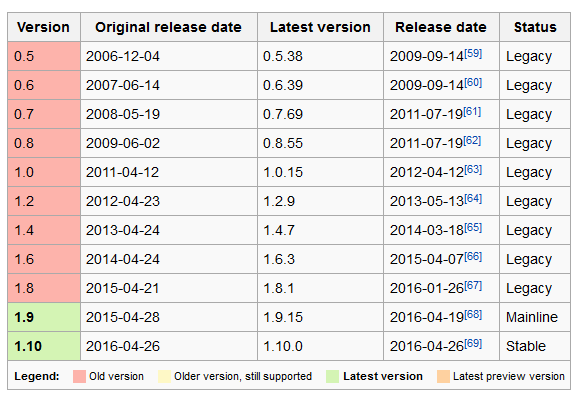

# CentOS คืออะไร ?

CentOS คือ ระบบปฏิบัติการ Linux ที่ได้รับการสนับสนุนจากแหล่งข้อมูลที่ Red Hat Enterprise Linux (RHEL) แบ่งปันให้ CentOS โดยสาธารณะ 
โดย CentOS มีวัตถุประสงค์เพื่อให้สามารถทำงานร่วมกับ RHEL ได้ โครงการ CentOS ส่วนใหญ่มีการเปลี่ยนแปลงแพคเกจเพื่อให้ Centos ลบการสร้างตราสินค้าและงานศิลปะ CentOS 
ไม่มีค่าใช้จ่ายและแจกจ่ายฟรี แต่ละรุ่นของ CentOS จะถูกเก็บรักษาไว้ได้นานถึง 10 ปี 
(โดยวิธีการอัพเดตด้านความปลอดภัย - ระยะเวลาการสนับสนุนโดย Red Hat มีการเปลี่ยนแปลงไปตามช่วงเวลาที่เกี่ยวกับแหล่งที่มา) 
รุ่น CentOS ใหม่จะออกประมาณทุกๆ 2 ปีและแต่ละรุ่น CentOS จะได้รับการอัปเดตเป็นระยะ ๆ (ประมาณทุกๆ 6 เดือน) เพื่อสนับสนุนฮาร์ดแวร์รุ่นใหม่ 
ส่งผลให้ระบบลีนุกซ์มีความปลอดภัยบำรุงรักษาต่ำเชื่อถือได้คาดการณ์ได้และสามารถทำซ้ำได้

## ตัวอย่างหน้า Desktop ระบบปฏิบัติการ Linux CentOS

# Web server คืออะไร

Web server คือ เครื่องคอมพิวเตอร์ ที่ติดตั้งโปรแกรมคอมพิวเตอร์ ซึ่งทำหน้าที่ให้บริการข้อมูล แก่ Client หรือ เครืองคอมพิวเตอร์ที่ขอรับบริการ ในรูปแบบ สื่อผสม 
ผ่านระบบเครือข่าย โดยสามารถแสดงผล ผ่านโปรแกรมเว็บบราวเซอร์ หรืออาจกล่าวได้ว่า Web server คือโปรแกรมที่คอยให้บริการแก่ Client 
ที่ร้องขอข้อมูลเข้ามาโดยผ่าน web browser

โปรแกรมที่นิยมนำใช้เป็นเครื่องบริการเว็บ ได้แก่ อาปาเช่ (Apache Web Server) และไมโครซอฟท์ไอไอเอส (Microsoft IIS = Internet Information Server)เป็นต้น

# เวอร์ชั่นของ Nginx

# เวอร์ชั่นของ Apache

.png)
