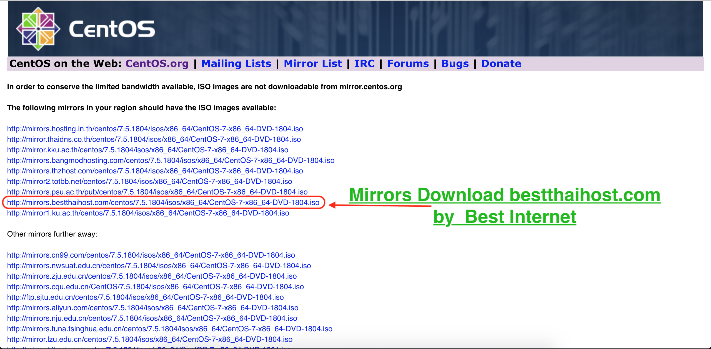
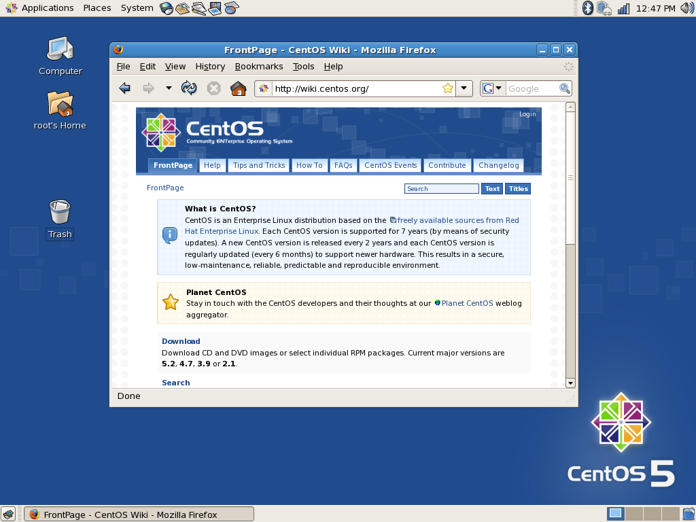

# CentOS คืออะไร ?

CentOS คือ ระบบปฏิบัติการ Linux ที่ได้รับการสนับสนุนจากแหล่งข้อมูลที่ Red Hat Enterprise Linux (RHEL) แบ่งปันให้ CentOS โดยสาธารณะ 
โดย CentOS มีวัตถุประสงค์เพื่อให้สามารถทำงานร่วมกับ RHEL ได้ โครงการ CentOS ส่วนใหญ่มีการเปลี่ยนแปลงแพคเกจเพื่อให้ Centos ลบการสร้างตราสินค้าและงานศิลปะ CentOS 
ไม่มีค่าใช้จ่ายและแจกจ่ายฟรี แต่ละรุ่นของ CentOS จะถูกเก็บรักษาไว้ได้นานถึง 10 ปี 
(โดยวิธีการอัพเดตด้านความปลอดภัย - ระยะเวลาการสนับสนุนโดย Red Hat มีการเปลี่ยนแปลงไปตามช่วงเวลาที่เกี่ยวกับแหล่งที่มา) 
รุ่น CentOS ใหม่จะออกประมาณทุกๆ 2 ปีและแต่ละรุ่น CentOS จะได้รับการอัปเดตเป็นระยะ ๆ (ประมาณทุกๆ 6 เดือน) เพื่อสนับสนุนฮาร์ดแวร์รุ่นใหม่ 
ส่งผลให้ระบบลีนุกซ์มีความปลอดภัยบำรุงรักษาต่ำเชื่อถือได้คาดการณ์ได้และสามารถทำซ้ำได้

ตัวอย่างหน้า Desktop ระบบปฏิบัติการ Linux CentOS

b.com/categories/github-pages-basics/) or [contact support](https://github.com/contact)
